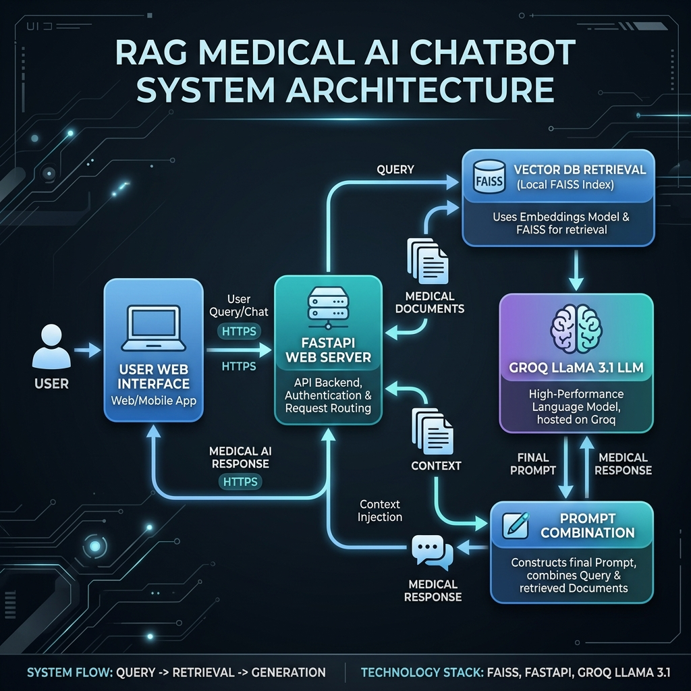

# 🏥 Medical Chatbot

A RAG (Retrieval-Augmented Generation) based medical question answering system that uses your medical knowledge base PDF to provide accurate medical information.

## 🎯 Project Overview

This is a comprehensive medical chatbot application with both backend API and modern React frontend. The system uses Retrieval-Augmented Generation to provide accurate medical information based on a provided medical knowledge base.

## 🏗️ System Architecture




## ✨ Key Features

- **Knowledge Base**: Uses `Medical_book.pdf` as the primary medical knowledge source
- **Advanced Embedding**: Generates embeddings using Hugging Face sentence transformers
- **Efficient Vector Storage**: Stores embeddings in FAISS vector database for fast similarity search
- **Intelligent Retrieval**: Retrieves relevant medical context based on user queries
- **LLM Integration**: Uses Groq's LLaMA 3.1 8B model for high-quality response generation
- **Multiple Interfaces**: 
  - Modern React web interface with streaming responses
  - Command-line interface for direct interaction
  - RESTful API for integration
- **Smart Caching**: Intelligent caching of vector indices for faster subsequent queries
- **Real-time Streaming**: Streaming responses for better user experience

## 🛠️ Tech Stack

### Backend
- **LangChain**: Framework for building LLM applications
- **Hugging Face**: Embedding models and transformers
- **FAISS**: Vector similarity search engine
- **Groq**: Fast inference for LLMs (LLaMA 3.1 8B)
- **FastAPI**: High-performance web API framework
- **Python**: Core programming language

### Frontend
- **React**: Modern component-based UI library
- **TypeScript**: Type-safe JavaScript
- **Vite**: Fast build tool and development server
- **Tailwind CSS**: Utility-first CSS framework
- **shadcn/ui**: Reusable UI components
- **Framer Motion**: Smooth animations and transitions

## 🚀 Getting Started

### Prerequisites
- Python 3.8+
- Node.js 16+ (for frontend)
- Groq API key
- Hugging Face token

### Backend Setup

1. Navigate to the backend directory:
```bash
cd backend
```

2. Install Python dependencies:
```bash
pip install -r requirements.txt
```

3. Ensure your `.env` file contains the required API keys:
```env
GROQ_API_KEY="your_groq_api_key"
HUGGINGFACEHUB_API_TOKEN="your_huggingface_token"
```

### Frontend Setup

1. Navigate to the frontend directory:
```bash
cd frontend/health-connect-chat
```

2. Install Node.js dependencies:
```bash
npm install
```

## 📖 Usage

### Option 1: Web Interface (Recommended)
```bash
# Start backend API
cd backend
python api.py

# In another terminal, start frontend
cd frontend/health-connect-chat
npm run dev
```
Then open your browser to `http://localhost:5173`

### Option 2: Command Line Interface
```bash
cd backend
python medical_chatbot_simple.py
```

### Option 3: API Only
```bash
cd backend
python api.py
```
The API will be available at `http://localhost:8000`

### Option 4: Using Batch Files (Windows)
- Double-click `run_chatbot.bat` for CLI version
- Double-click `run_api.bat` for web API version

## 🌐 API Endpoints

When running the API server at `http://localhost:8000`:

- `GET /` - Health check and welcome message
- `GET /health` - Service status
- `GET /info` - System information
- `POST /ask` - Ask medical questions (non-streaming)
- `POST /ask-stream` - Ask medical questions (streaming)
- `POST /contact` - Contact form submission

### Example API Usage:
```bash
curl -X POST "http://localhost:8000/ask" \
  -H "Content-Type: application/json" \
  -d '{"question": "What are the symptoms of diabetes?"}'
```

## 📁 Project Structure

```
Medical_chatbot/
├── .env                    # Environment variables
├── README.md              # This file
├── backend/               # Backend API and core logic
│   ├── api.py            # FastAPI web server
│   ├── medical_chatbot_simple.py  # Main RAG implementation
│   ├── Medical_book.pdf  # Medical knowledge base
│   ├── requirements.txt  # Python dependencies
│   ├── run_api.bat       # Windows API launcher
│   ├── run_chatbot.bat   # Windows CLI launcher
│   ├── .indices/         # Vector database indices
│   └── README.md         # Backend documentation
└── frontend/             # React frontend application
    └── health-connect-chat/
        ├── src/          # Source code
        ├── public/       # Static assets
        ├── package.json  # Node.js dependencies
        └── ...           # Other frontend files
```

## ⚙️ How It Works

1. **Document Processing**: Loads and splits the medical PDF into manageable chunks
2. **Embedding Generation**: Creates vector embeddings using sentence transformers
3. **Index Building**: Stores embeddings in FAISS for efficient similarity search
4. **Query Processing**: Takes user questions and retrieves relevant medical context
5. **Response Generation**: Uses LLM to generate accurate medical responses
6. **Streaming Delivery**: Delivers responses in real-time for better UX

## 📝 Notes

- **First run**: Will take 2-5 minutes to process the PDF, generate embeddings, and build the vector index
- **Subsequent runs**: Use cached indices for faster responses (few seconds)
- **Knowledge scope**: The system only uses information from your Medical_book.pdf
- **Medical accuracy**: Responses are generated based on the provided medical document
- **Performance**: `medical_chatbot_simple.py` includes pre-loading for better performance
- **Security**: API includes proper CORS configuration and request validation

## 🛠️ Troubleshooting

- **FAISS errors**: Ensure `faiss-cpu` is installed: `pip install faiss-cpu`
- **TensorFlow warnings**: Can be safely ignored - the system will work correctly
- **API timeouts**: Wait for initial indexing to complete (check terminal logs)
- **CORS issues**: The API includes CORS middleware for frontend compatibility
- **Empty responses**: Check that Medical_book.pdf contains relevant information

## 🤝 Contributing

1. Fork the repository
2. Create your feature branch
3. Commit your changes
4. Push to the branch
5. Open a pull request